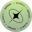

<h1>
    
    NLW Expert 
</h1>

## 📚 Confira meu caderno de estudos:

## 📝 Ferramentas utilizadas no NLW

- [Guia do Evento](https://efficient-sloth-d85.notion.site/Guia-do-evento-c2739d8da21e40d799fbe68ba892c780)
- [Notion - NLW 14 Expert](https://efficient-sloth-d85.notion.site/NLW-14-Expert-9e11ff472de64b08a5f9e277a20c3ecc)
- [Wallpapers - NLW Expert](https://drive.google.com/drive/folders/1bdX5SIrw6MBBqBkZgryc4H_omPQhuPx-)
- [GitHub do Projeto](https://github.com/rocketseat-education/nlw-expert-react)
- [Figma - Protótipo do projeto](https://www.figma.com/community/file/1336456128647909148)
- [ViteJs](https://vitejs.dev/)
- [Tailwind](https://tailwindcss.com/docs/guides/vite)

<table>
  <thead>
    <tr align="left">
      <th>Nº</th>
      <th>Status</th>
      <th>Etapas</th>
      <th>Projetos</th>
    </tr>
  </thead>
  <tbody align="left">
    <tr>
      <td>01</td>
      <td></td>
      <td>Aula 01</td>
      <td align="center">
        
      </td>
    </tr>
    <tr>
      <td>02</td>
      <td></td>
      <td>Lógica de programação: mergulhe em programação com JavaScript</td>
      <td align="center">
        
      </td>
    </tr>
    
    
    </tbody>
  <tfoot></tfoot>
</table>

 

##### Desenvolvido por Elizabete Fabri 💚